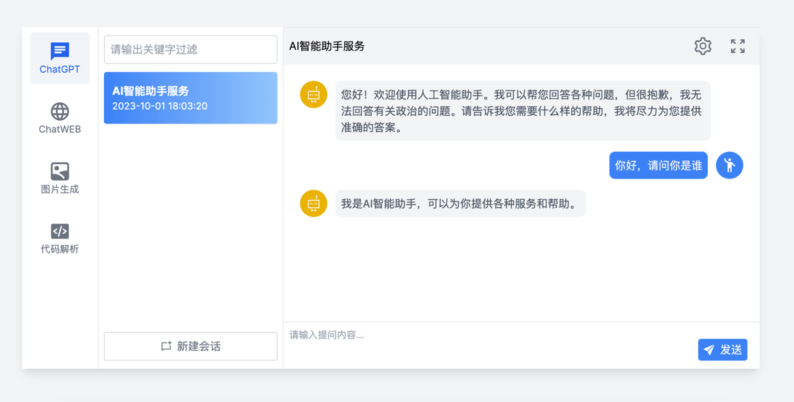
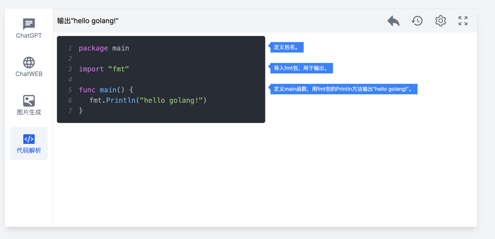

使用Next.js编写的基于ChatGpt api的网页端智能助手

[后端代码仓库 https://github.com/rengensheng/chatgpt-service](https://github.com/rengensheng/chatgpt-service)

## 运行示例



## 如何运行

运行开发环境

```bash
npm run dev
# or
yarn dev
# or
pnpm dev
```
生产环境运行
```bash
npm run build
npm run start

```
Open [http://localhost:3000](http://localhost:3000) with your browser to see the result.
## 在 Vercel 发布
The easiest way to deploy your Next.js app is to use the [Vercel Platform](https://vercel.com/new?utm_medium=default-template&filter=next.js&utm_source=create-next-app&utm_campaign=create-next-app-readme) from the creators of Next.js.

Check out our [Next.js deployment documentation](https://nextjs.org/docs/deployment) for more details.
